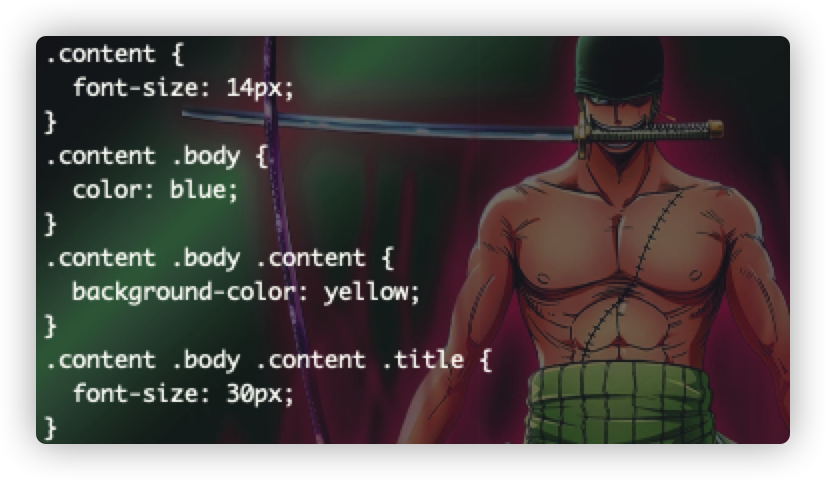
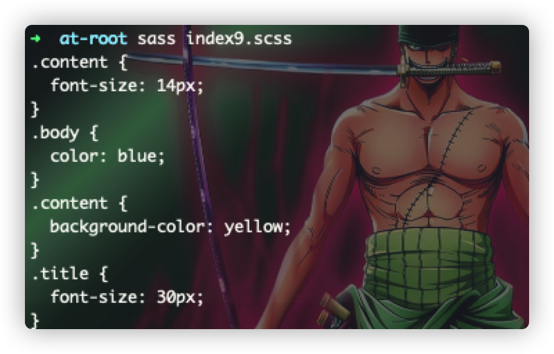

# @at-root
请先看 :point_down: 的一段sass代码：
```scss
.content{
	font-size: 14px;
	.body{
		color: blue;
		.content{
			background-color: yellow;
			.title{
				font-size: 30px;
			}
		}
	}
}
```


:star2:
从上面可输出css样式结果可以看出，随着嵌套的层次的加深，编译输出的层次将越加越来越多，而且也会慢慢地增加输出的css代码体积

> sass提供了一种`@at-root`的语法规则，可以解决 :point_up:
> 所遇到的问题，其语法规则如下：  
> `@at-root (with/without) { // 样式代码块 }`  
> 代码如下所示：

```scss
.content{
	font-size: 14px;
	@at-root .body{
		color: blue;
		@at-root .content{
			background-color: yellow;
			@at-root .title{
				font-size: 30px;
			}
		}
	}
}
```

