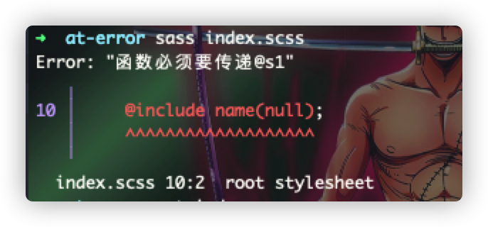

# @error
> 与我们平时编写的代码一样，在编写sass语句的时候，同样允许我们可以在验证编码结果的同时，输出某个变量/表达式的值，并输出上下文错误的堆栈信息，语法规则如下：
> `@error <expression>`  
> 一般可用于某个变量/表达式在使用之前值的一个校验规则，而且一旦执行了该语句时，立马停止继续往下编译，
> 如下所示：

```scss
@mixin name($s1){
	@if $s1 == null {
		@error '函数必须要传递@s1';
	}
	font-size: 20px;
	border-number: $s1;
}

.content{
	@include name(null);
}
```

