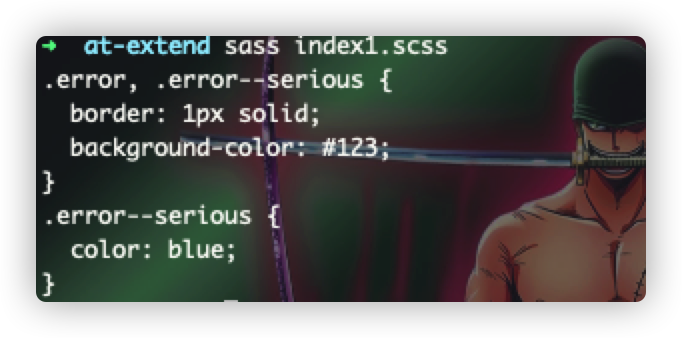
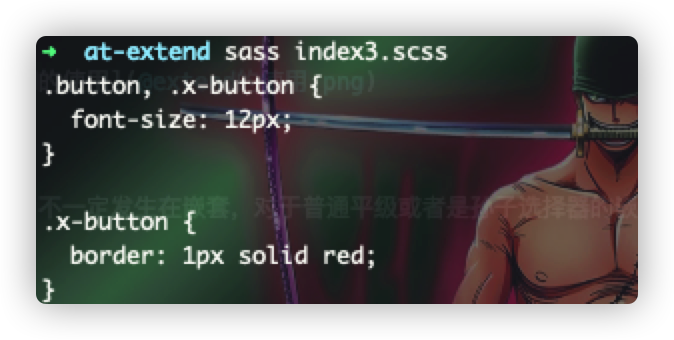
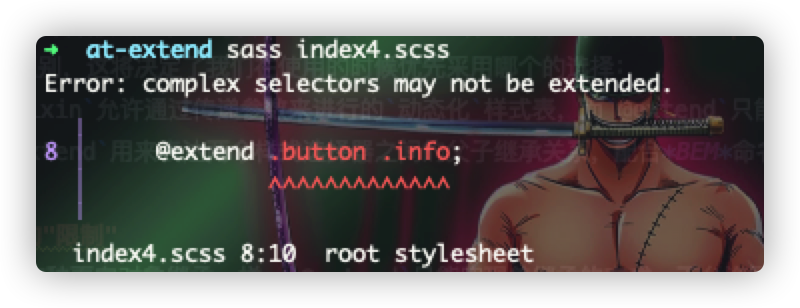
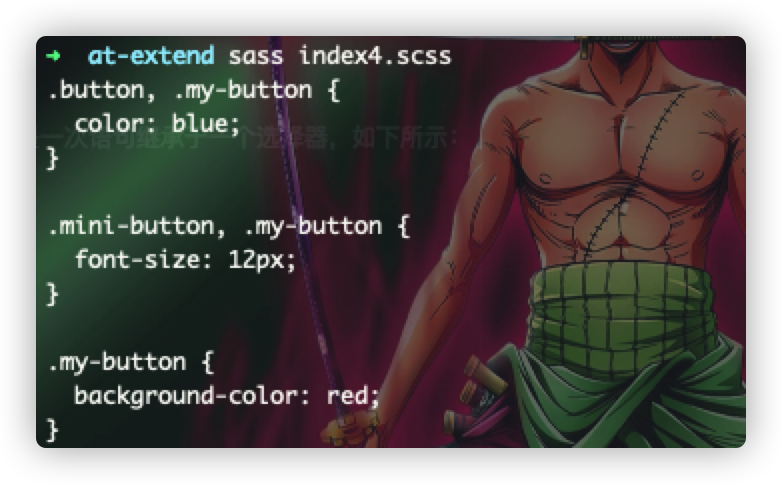

# @extend
> 与普通的对象/类的继承思维模式一样，`@extend`主要用于阐述两个样式选择器之间的一个关联关系：一个作为子类，一个作为父类，子类继承父类的所有属性，还可以在子类中追加自身的额外特殊属性，来完成子类选择器的编写，
> 其语法规则如下： `@extend <selector>`

```scss
.error{
	border: 1px solid;
	background-color: #123;
	&--serious{
		@extend .error;
		color: blue;
	}
}
```


:star2:
`@extend`不一定发生在嵌套，对于普通平级或者是孙子选择器的嵌套也同样适用，如下所示：
```sass
.button{
	font-size: 12px;
}
.x-button{
	@extend .button;
	border: 1px solid red;
}
```


:stars: 这里推荐使用嵌套是由于 :u6709:
一个团队提出了一个广为业界开发者所认同的一个关于css的命名规范：*BEM*，而且现有的大部分UI框架都采用了这种命名规范！！！

### `@extend`与`@mixin`的区别
> 首先，这两者都是用来**封装与重复利用**sass样式文件的，但两者有 :point_down:
> 两点的区别，这将决定了我们在使用的时候优先采用哪个的选择：
> 1. `@mixin`允许通过传递参数来进行的`动态化`样式表，而`@extend`只能是原样接收；
> 2. `@extend`用来表达两个样式选择器之间的父子继承关系，配合*BEM*命名，可规范化css。

### 继承的"限制"
> 与java这种面向对象继承一样，`@extend`只能实现单继承的方式，不允许同时继承多个样式选择器，一次语句只能继承于一个样式选择器，
> 如下所示：

```scss
.button{
	color: blue;
}
.mini-button{
	font-size: 12px;
}
.my-button{
	@extend .button .info;  //这里将会直接报错
	background-color: red;
}
```


:star2: 要同时继承与两个样式选择器的话，只能是一次语句继承于一个选择器，如下所示：
```scss
.button{
	color: blue;
}
.mini-button{
	font-size: 12px;
}
.my-button{
	@extend .button;
	@extend .mini-button;
	background-color: red;
}
```

