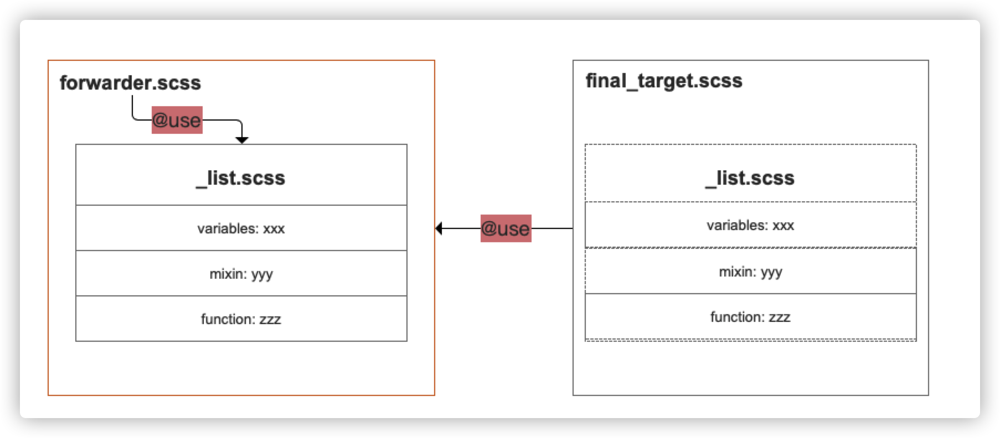
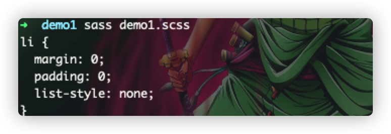
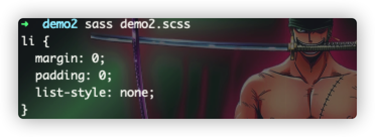

# @forward
> 转发规则，有点类似于`@use`规则，但它是主要是用于`"控制组装"`从@use中引入而来的资源模块(变量、混入、函数，本文以下统称资源模块)，简单地理解是@forward可以原封不动地将从@use中引入的资源，直接暴露给下一个forward使用者，或者是加上自己的一个装饰，然后再
> 暴露给到下一个forward使用者，而且在转发后，使用的导入的模块资源时，必须采用转发者forwarder的命名空间



通过 :point_up:
关于`@forward`的一个工作过程效果图，我们可以很清楚地理解整个转发的过程！！

```scss
// _list.scss
@mixin list-reset{
  margin: 0;
  padding: 0;
  list-style: none;
}
// forwarder.scss
@forward "list";
// demo.scss
@use "forwarder";
li{
  @include forward.list-reset
}
```


### 添加样式前缀
> 在使用转发的过程中，我们可以通过给`@use`得到的资源进行样式前缀的追加，由同一份代码来生成不同命名空间下的模块资源(变量、函数、混入)，并且每个引入而来的资源模块，都可以添加统一的前缀，
> 主要通过：`@forward 'library' as <prefix>-*`
> 的方式，来给导入而来的每一个资源添加统一的前缀

```scss
// _list.scss
@mixin reset{
	margin: 0;
	padding: 0;
	list-style: none;
}
// _bootstrap.scss
@forward "list" as list-*;
// demo2.scss
@use "bootstrap";
li{
  @include bootstrap.list-reset;
}
```


### 转发控制模块可见性
> 既然可以使用转发来暴露资源模块，那么应该也是可以通过某种机制，来控制转发的资源模块的可见行：
> `@forward "library_path" show/hide <members...>`
>
> :stars:
> 这感觉很像在之前文章中的`@use的通过-/_的方式来将资源模块保护起来`有点异曲同工之处，虽然写法使用上有区别，但目的是一样的

### 可配置的转发
> 转发也是像`@use`的使用默认配置方式一致，只不过是变成了深层次的转发而已

:trollface:
跟人感觉这个`@forward`有点鸡肋，使用上基本上都有替代方案，或者有更好的实现机制，目前还未能发现它的一个可用之处～～
