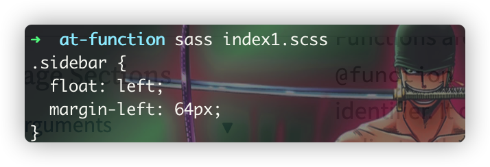

# @function
> 与普通的函数一样，`@function`接收一系列参数，经过内部的逻辑运算处理能力，最终返回目标结果值，看着感觉好像与之前习🉐️的`@mixin`有点雷同，但他们两者还是
> :u6709: 一些区别的：
> 1. `@function`的返回值是一个值(sass所支持的数据类型),确切地说，应该是一个右值，而`@mixin`则是一个样式代码块；
> 2. `@function`必须要有`@return`标志的返回值，一般作为sass属性的样式值；
> 3. `@function`无需通过`@include`进行引用，而是直接调用

```scss
@function pow($base, $exponent){
  $result: 1;
  @for $_ from 1 through $exponent {
    $result: $result * $base;
  }
  @return $result;
}
.sidebar{
  float: left;
  margin-left: pow(4, 3) * 1px;
}
```


:warning:
在`@function`中有可能会不小心访问并改变到了全局变量，但是**尽量避免这么做**，这与咱们平时良好的coding习惯:u6709:
关，任何函数应当是面向接口面呈的，在接收同等参数的情况下，返回的结果应该是一样的，期间不应该会因为改变到了全局变量，而导致的在传递同样参数返回的不同结果，假如真的有这个修改到
全局变量的必要的话，那么尽量是在一开始就完成了这个修改动作，而不是在程序执行过程中来修改！！！

### 函数的参数
> 与`@mixin`中的参数一致，详见[mixin中的参数](/at-rules/at-mixin-and-include/readme.md#mixin的参数)
