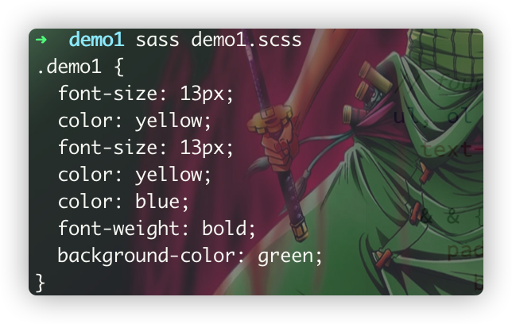
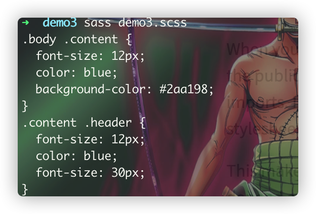

# @import
> **一个与@use类似、但在不久的见谅将会被铲掉的语法规则！！！**
>
> sass中的`@import`继承了css中的`import`语句规则，允许从外部引入资源模块(变量、函数、混入)，然后对其进行组合，与普通的css中的`import`所不同的是：
> 1. sass中的`@import`是在编译是完成的，而css中`import`则是通过http协议来请求加载到资源的；
> 2. sass中的`@import`可以通过逗号分割来将要被导入的模块分割并同时加载，而css中的`import`一次只能导入一个。

:warning: **官方建议：未来将铲掉`@import`**，原因主要有一下几点：
1. **@import使得导入的资源模块变得全局可用**，这一点非常的重要，这也是与`@use`规则所最大的不同点，全局可用，方便资源访问的同时，也会引发对应的问题：增加问题排查的复杂度，因为不知道资源模块在什么时候以及在哪里被定义了，而且没办法给它加上命名空间的前缀，用以区分开来；
2. 假如使用了`@extend`语句，很难晓得资源是在哪里被继承而来的；
3. 每次`@import`都是会重新导入，这徒增了代码；
4. 假如想要保护导入的部分资源，用`@import`是无法实现的。

:stars: 鉴于上述 :point_up:
提及到的一些场景，后续在使用sass中导入时，尽量采用`@use`关键词来引入资源模块，假如现有项目使用的`@import`的话，那么可以使用官方的迁移工具：
[migration tool](https://sass-lang.com/documentation/cli/migrator)，来实现

```scss
// _module1.scss
@mixin m1 {
	font-size: 13px;
	color: yellow;
}
// _module2.scss
@import "module1";
@mixin m2 {
	@include m1;
	color: blue;
	font-weight:bold;
}
// demo1.scss
@import "module1";
@import "module2";

.demo1{
	@include m1;
	@include m2;
	background-color: green;
}
```


从 :point_up:
我们可以看出关于`@import`的一个使用，就真的是跟js中的var定义变量的方式类似，对于import进来的资源模块，无需加入模块的命名空间，
这有点让自己在调试的时候，不知道资源模块是在哪里被定义的！

### 模块的加载(这与@use一致)
[模块的加载](/at-rules/at-use/readme.html)

### 嵌套导入
> 一般情况下，我们是在样式顶层位置的地方编写导入资源模块的语句，但是我们也可以在嵌套的上下文中来导入，如下所示：

```scss
// _module.scss
@mixin m1 {
	font-size: 20px;
	color: blue;
}
// demo2.scss
.header{
	//@include m1;   -->这里将会报错
}
.body{
	.content{
//		@include m1;   -->这里将会报错
	}
	background-color: yellow;
	@import "module.scss";
	@include m1;
}
.footer{
	//@include m1;   -->这里将会报错
}
```
:point_up:
这里只有在嵌套的`.body`作用域下m1才是全局的，在其他模块作用域下，则不是！！

:star2:
由于`@import`可以使用嵌套导入，那么它这里关于*父选择器*的作用就彰显出来了，如下代码所示：
```scss
// _module.scss
@mixin m1{
  font-size: 12px;
  color: blue;
}
// demo3.scss
.content{
  @import "module";
  .body &{
    @include m1;
    background-color: #2aa198;
  }
  & .header{
    @include m1;
    font-size: 30px;
  }
}
```



### 与`@use`的区别
1. `@import`中定义的资源模块都是全局的，无需添加命名空间来限定；
2. `@import`中定义的资源模块将会导致重复定义，因为它是每次导入都使用的；
3. `@import`一次可导入多个模块，用逗号分割即可；
4. `@import`导入可以不用引号包裹而直接导入；
5. 支持嵌套导入
