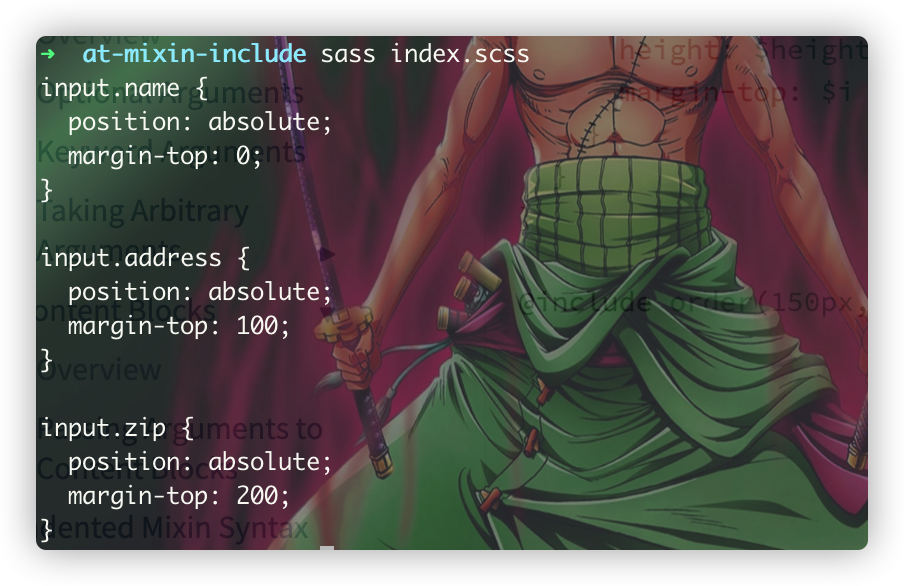

# @mixin与@include
> `@mixin`与`@include`一般成对存在，一个用于定义，一个用于引入。`@mixin`与其他语言的混入思想一致，旨在提供一套**可重复使用**的**可配置化**的样式代码块，其语法规则如下所示：
>   
> :point_up:
> 这里结合了函数与样式而形成的一种新型产物，一般可通过`@include`来引入，`@include`的规则会随着`@mixin`定义时的规则而定，比如传递了参数(或者列表、或者map、或者默认参数)而定，其语法规则如下：
> `@include <mixin_name> (<argument...>)`

```scss
// _module.scss
@mixin blue-font{
  font-size: 24px;
  color: blue;
}
// demo1.scss
@use 'module';
.content{
  @include module.blue-font;
}
```


:warning:
因为历史原因，有一个点需要注意的是：中横线与下划线所定义的mixin名称，两者代表的是同一个意思！！！

### mixin的参数
> 类似于函数，`@mixin`允许携带参数，这意味着允许携带参数将样式代码块变成具有逻辑运算能力的样式代码块

```scss
// demo2.scss
@mixin padding-num ($size){
	padding: $size;
}

.content{
	@include padding-num(20px);
}
```


#### 可选的参数
> 与ES6.0中的函数类似，通过对函数参数进行解构赋值的方式，对`@mixin`进行参数配置化，意味着这里定义的`@mixin`中的参数，可以全都传递过来，也可以根据情况进行可选性传递，来达到不同效果的`@mixin`输出

```scss
@mixin optional-argument($size, $radius: 0){
  width: $size;
  height: $size;
  @if $radius != 0 {
    border-radius: $radius;
  }
}
.content{
  @include optional-argument(20px, 10px);
}
```


#### 像map一样的参数
> 在通过 :point_up:
> 可选参数的方式来使用`@mixin`时，也可以通过提供像*map*中的`key*value`的方式，来提供*无序化传参*的机制，比如我们定义了接收
> ($1:0,$2:1,$3:2)的方式，然后只想传递其中的$2的值的话，那么可以直接只传递($2:10)的方式，来传递参数，达到无需严格关注每一个参数的位置：

```scss
@mixin mapArgument($s1: 0, $s2: 0, $s3: 0){
  @if $s1 != 0 {
    padding: $s1;
  }
  @if $s2 != 0 {
    margin: $s2;
  }
  @if $s3 != 0 {
    border-radius: $s3;
  }
}
.content{
  @include mapArgument($s2: 10px);
}
```
 :point_up:
从上面我们可以看出我们定义的`@mixin`定义了3个参数，然后我们在调用这个mixin的时候，只传递了第二个参数$s2，无需关心这个参数出现在第几个位置，而是只需要关注定义的这个参数的key的名称即可，
大大提高了编写的`@mixin`的灵活度！！

#### 可接收任意数量的参数
> 这与ES6.0中的*对象/数组扩展符*有些相类似，通过定义传参后，加多一个`...`标识符的方式，将该参数变量变成一个数组或者是一个可展开的对象，来实现对*数组/对象*的处理(比如for循环)

```scss
@mixin spreadArray($argument...){
  @for $i from 0 to length($argument){
    #{nth($argument, $i + 1)} {
      position: absolute;
      margin-top: $i * 100;
    }
  }
}
@include spreadArray("input.name", "input.address", "input.zip");
```


:star2: 接收一整个对象参数

```scss
@use "sass:meta";
@mixin spreadObj($argument...){
  @debug meta.keywords($argument);
  @each $name, $color in meta.keywords($argument){
    pre span.stx-#{$name}{
      color: $color;
    }
  }
}
@include spreadObj(
  $string: #009,
  $comment: #812,
  $variable: #531
)
```


### 像参数一样思考来传递代码块
> 像参数传递模块一样来思考，`@mixin`允许将一整块样式代码块通过关键词`@content`来传递，这样子之后，mixin使用者也可以像参数一样来编写样式代码块了。

```scss
@mixin hover{
  &:hover{
    @content;
  }
}
button{
  @include hover{
    background-color: #2aa198;
    color: white;
  }
}
```


:star2:
`@content`是mixin的mixin，因为mixin原本就是代码块，而`@content`是代码块的占位符，那么它也可以像`@mixin`来思考，提供参数的机制，
来生成动态的代码块，语法规则是：  
定义：  
`@content (<arguments...>)`

使用：  
`@include <mixin_name> (<mixin_arguments...>) using
(<content_arguments>) { // 代码块 } `

```scss
@mixin media($types...) {
  @each $type in $types {
    @media #{$type} {
      @content($type);
    }
  }
}

@include media(screen, print) using ($type) {
  h1 {
    font-size: 40px;
    @if $type == print {
      font-family: Calluna;
    }
  }
}
```

