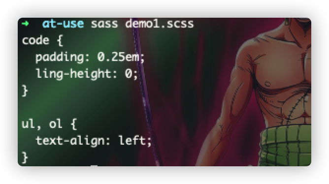
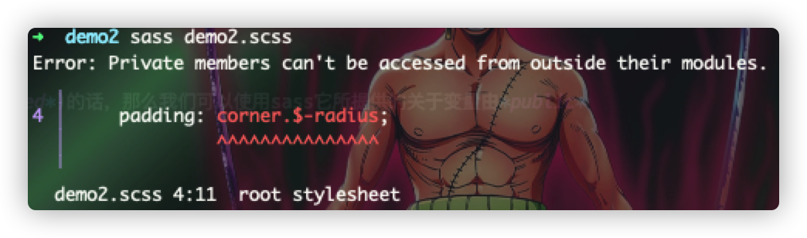
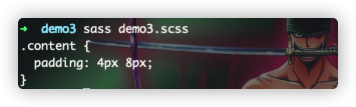
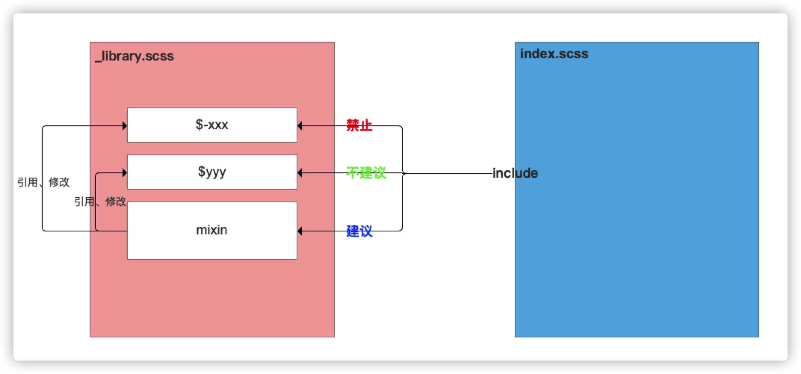
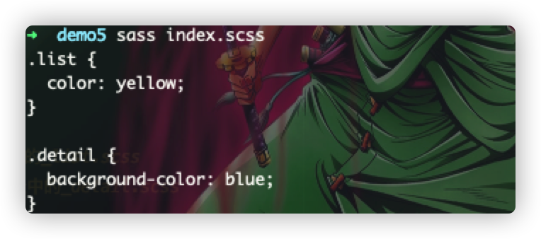

# @use
> sass中的`@use`有点类似于ES6中的`import`关键词，主要用来加载其他sass样式文件中的*mixin、function、variable*，也可以用来加载普通的css文件，并对加载到的资源以及自身的资源进行组合，sass框架也提供了一些便捷的函数，
> 供我们直接通过`@use`来使用！`@use`的一个完整的语法规则：
`@use <library> with (<key>: <value>, <key>: <value>) as <otherName>/*`

针对 :point_up: 的参数进行对应的解释如下：
1. library: 使用的sass库文件;
2. with: 对于可配置的库而言，通过该关键词来进行参数的传递;
3. `(<key>: <value>...)`: 要配置的自定义参数;
4. `as <otherName>`: 将引入的库用一个别名，也叫命名控件*namespace*来替代；
5. as *: 将引入的库直接当作当前文件的变量来直接访问，无需进行添加`库名.`前缀；
6. 如果没有使用as关键词的话，那么将默认使用目录的最后一个字符串来作为*namespace*，供后续访问使用。

:star2:
在实际的编码过程中，如果将一个*.scss文件多次引入(@use)的话，那么在最终的输出时，只会被输出一次

```scss
  // _code.scss
  $p: 10px;
  code {
  padding: .25em;
  line-height: 0;
}
// _list.scss
  @mixin name{
  //...
  }
    ul, li{
        text-align: center;
    }
// demo1.scss
@use 'code';
@use 'list';
```


### 成员属性的加载
> 在通过使用`@use`来引入库资源之后，我们就可以通过`<namespace>.<variable>`、`<namespace>.<mixin>`、`<namespace>.<function>`来访问库文件中的变量、混入、函数。
> 如下所示：

```scss
@use 'code';
@use 'list';
.content{
  padding: code.$p;
  @include list.name;
}
```

:star: 而如果使用了*as*关键词来指向这个引用的库的话，那么可以如下：

```scss
// 使用别名的场景
@use 'code' as myCode;
.content{
  padding: myCode.$p;
}
// 使用通配符的场景
@use 'list' as *;
.content{
  @include name;
}
```

:star2:
假如我们想要想java一样进行sass库中某些变量进行保护起来(类似于*private*以及*protected*)的话，那么我们可以使用sass它所提供的关于变量由*public*
:point_right:
*private*：通过给变量在定义其名字的时候，在名字最前面添加一个`-/_`，
将成员给保护起来，这里的成员主要是指的变量、混入、函数！！如下所示：

```scss
// _corner.scss
$-radius: 3px;
@mixin -private_round{
  border-radius: $-radius;
}
@mixin public_round{
  border-radius: $-radius;
}
// demo2.scss
@use 'corner';
.button{
  @include corner.public_round;
  // 以下语句将会报错，提示不能访问内部私有成员
  padding: corner.$-radius; 
}
```


### 可配置参数的导入
> 在编写自己样式库时，我们可以通过标识符(`!default`)来告知该库中的某些变量是允许通过外部传入参数的方式来更改基础资源的，这让我们所编写的样式代码更加富有活力，灵活性更高

```scss
// _library.scss
$x: 1px !default;
$y: 2px !default;
@mixin common-pad{
  padding: #{$x} #{$y};
}
// demo3.scss
@use 'library' with ($x: 4px, $y:8px);
.content{
  @include library.common-pad;
}
```


### 最佳实践

在实际的日常coding过程中，尽量采用两个mixin结合，来输入自己所想要的目标样式结果，什么意思呢
:question:
简单来说，就是整两个*mixin*，一个用来更改当前库中的变量，一个用来输出目标结果样式，这样子在使用到配置参数的时候，都可以获取到最新的配置，为什么要这样子做呢
:question:
这样子不是徒增代码量吗？其实思考一个问题就可以想到这样子写的好处：当代码量越来越多的时候，发现有变量到处都被改变了，可能会引起错误的效果，因为@use都是N次导入，一次输出的。
具体实践方案如下：
```scss
// _library.scss
$x: 1px !default;
$y: 2px !default;
@mixin changeXY($newX, $newY){
  @if $newX{
    $x: $newX !global;
  }
  @if $newY{
    $y: $newY !global;
  }
}
@mixin common-pad{
  padding: #{$x} #{$y};
}
// demo4.scss
@use 'library';
.content{
  @include library.changeXY($newX: 4px, $newY: 5px);
  @include library.common-pad;
}
```
通过 :point_up:
的两种方式的对比，我们可以发现其中用两个mixin来替代一个mixin的方式要灵活一些，这个现象会在随着代码量的增多而变得更加明显！！

### 可修改的变量
> 当我们通过@use来引用一个变量的时候，我们可以访问到这个变量，那么是否也意味着我们可以修改变量的值？
> 答案是肯定，但是这对于模块化而言，这种行为是非常⚠️的，也应当被制止，但是有时就是防不慎防，所以，应该要提供一个机制，就是模仿面向类编程所采用的思维，利用*private以及protected*的保护机制，将需要隐藏的
> 变量都给保护起来！



### 模块加载
> 在sass中，一般建议将原本一个大的整体样式块进行拆分，然后将基本的作为其他的来使用，这有点像我们在面向对象中的模块化编程，统一对外只有一个入口，所有的访问都通过这个入口来进行访问。
> sass提供了一种特殊的模块化机制，称之为：**分包**，通过分包实现一个入口来访问，并自动加载被依赖的模块，分包采用`_*.scss`来命名，告知sass不要将该文件进行单独编译，而是作为一个分包
> 来加载，一般地，比如有以下的代码：

```scss
  // style/fundation/_list.scss
  .list{ color: yellow; }
  // style/fundation/_detail.scss
  .detail{ background-color: blue; } 
  // style/index.scss
  @use 'fundation/list';  //在fundation目录中的_list.scss
  @use 'fundation/detail';  //在fundation目录中的_detail.scss
```


:start2: 最佳实践：
结合css变量与sass分包加载逻辑，以及如果加载的是css的话，那么css将会原样输出，这里我们可以使用css变量，做全局控制，
由于加入了css变量，css变量的一个准则是，一旦变动全局影响，那么我们可以根据这个属性特征，来实现动态变换系统主题的功能，
然后利用sass将css变量原样输出，并借助于变量的引用，做到系统全局关联的目的！！！
