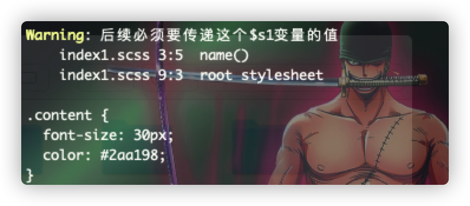

# @warn
> 与之前的`@error`使用类似，但 :u6709:
> 一点不同的是，它不会停止执行脚本编译，而是直接输出警告信息，并继续往下走，这可以在自己平时的关于css库的一些版本升级中提及，提示后续将没有这个逻辑之类的操作

```scss
@mixin name($s1){
  @if $s1 == null{
    @warn "后续必须要传递这个$s1变量的值";
  }
  font-size: 30px;
  color: #2aa198;
}
.content{
  @include name(null);
}
```


:stars: 从 :u6709:
可以看出`@warn`并不会停止编译，而是打印出警告的信息以及位置，然后程序继续往下执行！！！
