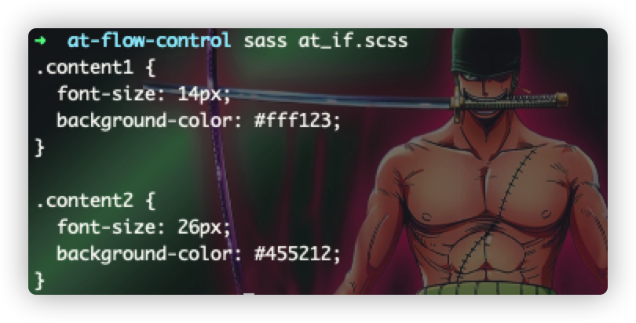
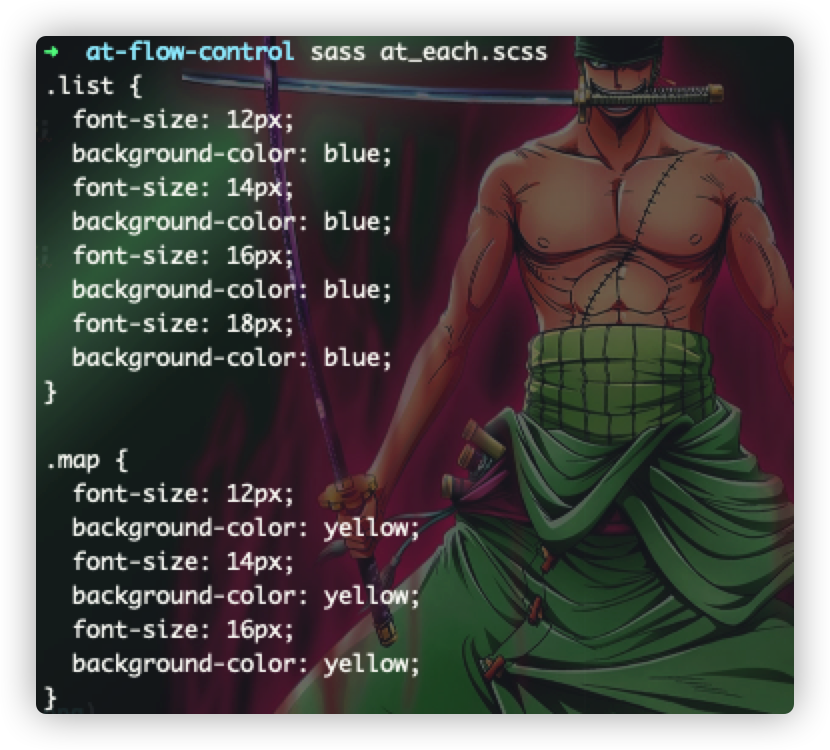
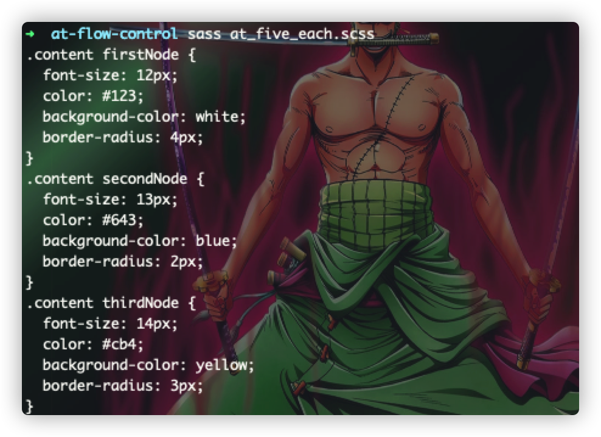
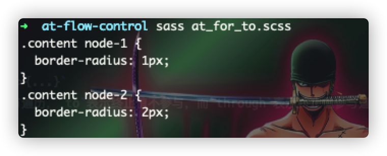
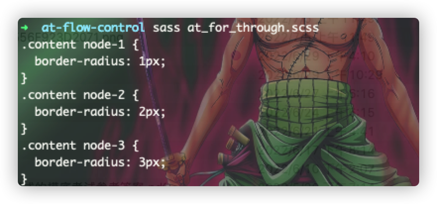
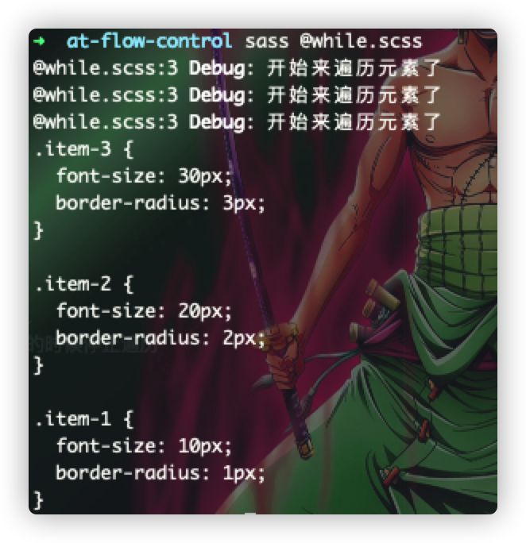

# 流程控制
> 在前面学习的关于编写sass的相关代码时，比如`@mixin`或者`@function`的时候，其实我们就已经接触关于sass中的流程控制的相关语法语句规则了，正如其他的编程语言一样，它允许通过
> `@if`来判断是否执行某个代码块，  
> `@each`来遍历list或者map对象中的每一个值，  
> `@for`来循环执行一定次数逻辑代码，  
> `@while`来执行知道条件不 :u6e80: 足为止！  
> 下面将一一介绍每个"艾特流程控制"语法的使用

### @if与@else
> 语法规则：`@if <expression> {...} @else if <expression> {...} @else`  
> `@if`一般与`@else`成对存在，与其他的编程语言类似，允许有多个不同的条件判断逻辑同时存在，通过真值与假值的判断，匹配执行对应的逻辑代码块

```scss
// at_if.scss
@mixin name($xxx) {
	@if $xxx != null {
		font-size: 14px;
		background-color: #fff123;
	}@else {
		font-size: 26px;
		background-color: #455212;
	}
}

.content1{
	@include name(#123);
}
.content2{
	@include name(null);
}
```


### @each
> 语法规则：`@each <variable> | <variable>,<variable> in <expression> {...}`
>
> 一般可用来生成由一个表达式结果(list/map)中的变量控制生成的可重复的样式代码，若表达式的是一个普通的list，则采用一个变量来作为每次迭代的值的存储，若表达式是一个map对象，则使用2个变量分别作为key与value来代表每次的迭代器

```scss
// at_each.scss
@mixin eachList($list){
	@if $list == null {
		@error "请传递对应的待迭代的数组对象";
	}
	@each $item in $list {
		font-size: $item;
		background-color: blue;
	}
}

@mixin eachMap($map){
	@if $map == null {
		@error "请传递对应的待遍历的键值对对象";
	}
	@each $key, $value in $map{
		#{$key}: $value;
		background-color: yellow;
	}
}

.list{
	$list: 12px, 14px, 16px, 18px;
	@include eachList($list);
}
.map{
	$map: "font-size" 12px, "font-size" 14px, "font-size" 16px;
	@include eachMap($map);
}
```


:stars:
当待遍历的表达式是一个二维的数组的情况下的话，它是否也能够🉐️到变量的替代与遍历呢？答案是肯定的，
:point_down: 采用一个二维的4孩子数组的方式来具体说明情况：

```scss
// at_five_each.scss
@mixin fiveEach($list){
  @if $list == null {
		@error "请传递对应的待迭代的数组对象";
  }
  @each $firstV, $secondV, $thirdV, $fourthV, $fivethV in $list {
    #{$fivethV} {
        font-size: $firstV;
        color: $secondV;
        background-color: $thirdV;
        border-radius: $fourthV;
    }
  }
}
.content{
  $list: 12px #123 white 4px firstNode,
         13px #643 blue 2px secondNode,
         14px #cb4 yellow 3px thirdNode;
  @include fiveEach($list);
}
```


### @for
> 语法规则：`@for <variable> from <expression> to/through <expression>{...}`
> 用于向上/向下遍历表达式，遍历的过程采用`to/through`来决定是否要将终止值参与遍历，`to`表示终止值不参与，而`through`表示终止值参与遍历

```scss
// at_for_to.scss
@mixin forTo(){
  @for $item from 1 to 3 {
    node-#{$item}{
      border-radius: #{$item}px;
    }
  }
}
.content{
  @include forTo();
}
```

```scss
// at_for_through.scss
@mixin forThgough(){
  @for $item from 1 through 3 {
    node-#{$item}{
      border-radius: #{$item}px;
    }
  }
}
.content{
  @include forThgough();
}
```


### while
> 语法规则：`while <expression> {...}`  
> 用于循环执行一个代码块，当变量表达式为假值的时候停止遍历

```scss
// @while.scss
@mixin name($val){
  @while $val > 0 {
    @debug "开始来遍历元素了";
    .item-#{$val}{
      font-size: 10px * $val;
      border-radius: #{$val}px;
    }
    $val: $val - 1;
  }
}
@include name(3);
```


:stars:
实际在编码过程中，尽量采用`@each`或者`@for`来实现`@while`的效果，这是因为这样子做的话，可以提升sass编译的速度！！！
