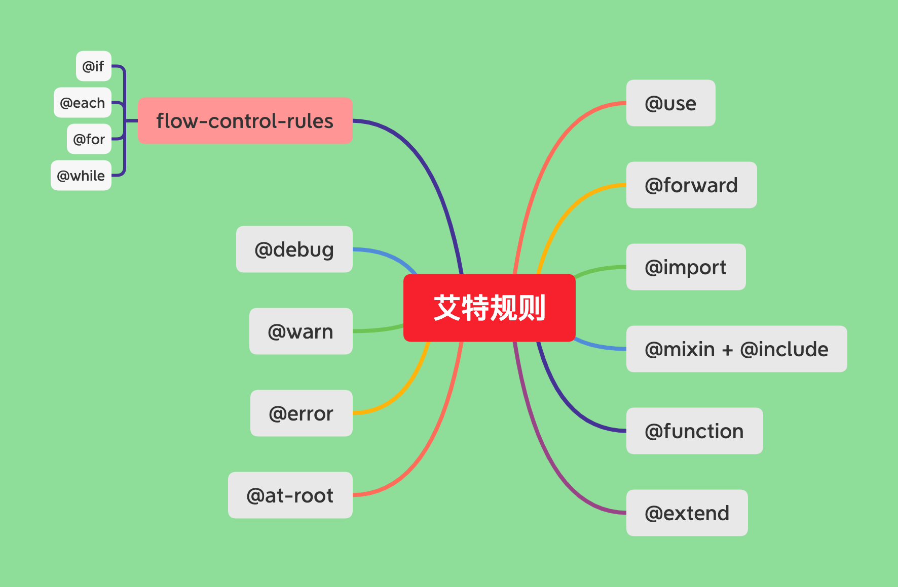

# "艾特"规则
> 官方文档叫：**@rules**，个人给它起了一个名字，叫艾特规则，本书上均统一叫这个名字，方便自己记忆！
> sass中的许多额外的功能，都是已艾特规则出现在css样式之上，一般是在最顶部，或者是在子作用域的顶部，反正就是顶部就是了。
> sass提供了以下的艾特规则，如下图：

得益于艾特规则，我们可以使用很多具有逻辑运算能力的css，编写出更加干练、简洁的代码，
:woman: 再也不用担心我只会编写出简单嵌套，重复冗余的css代码了！！！
