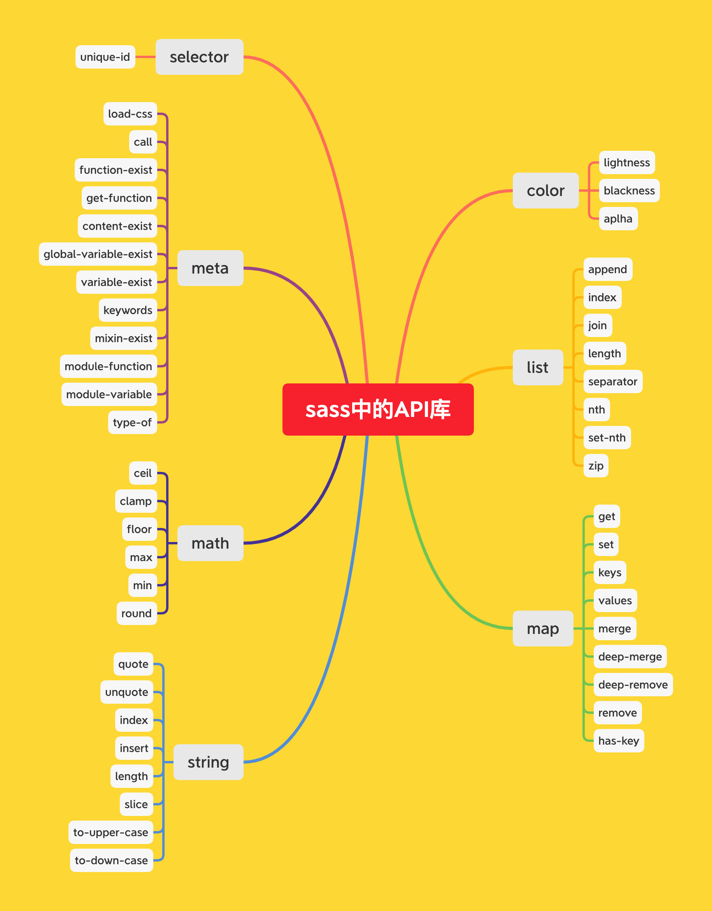

# 预设库
> sass中提供了一些库函数以及mixin来给使用者直接调用，比如想要操作/访问List数组对象，则可以使用`@use
> 'sass:list'`，然后通过`list.append($list,
> $item)`的方式来使用，这里有点像平时使用的全局静态API，用sass作为前缀，代表它是sass所提供的

:star: 在sass中也存在着那么的一些函数(`像if()、var()`)，它们无需被导入`@use
...`的方式来使用，而是直接使用，这个是由于历史的语法规则原因，而且后来用着也比较爽，因此官方也就没有废弃掉这种语法规则！

> 针对不同的数据类型，sass提供了一系列相关的API库来供使用！！！如下图：

:point_right: 具体的每个api的使用方式，详见官方的[说明文档](https://sass-lang.com/documentation/modules)
