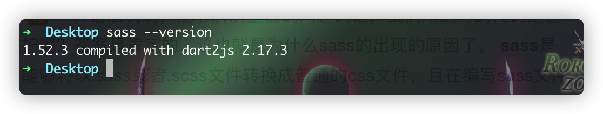
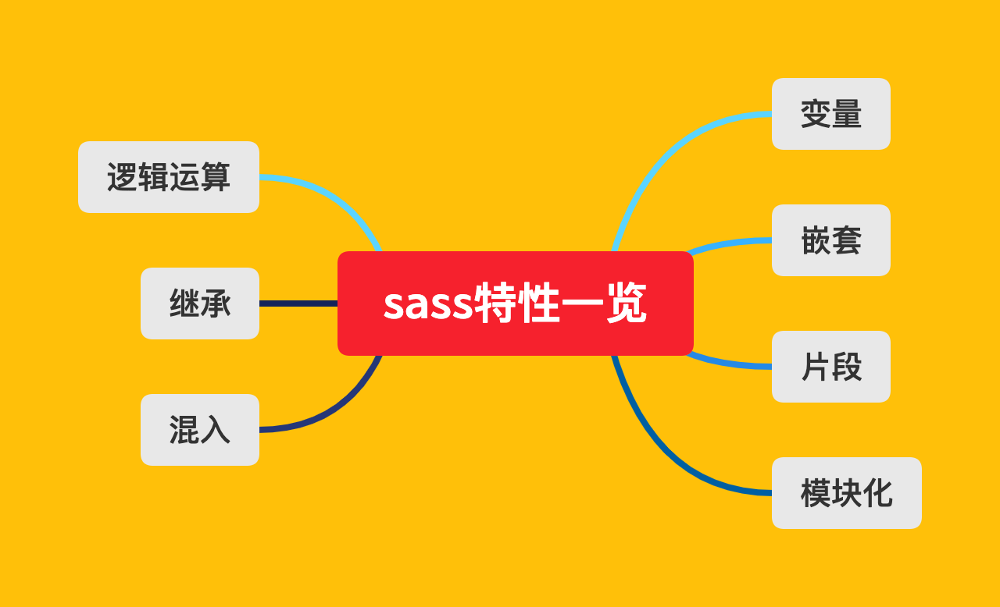

# 序言

> 在真正进入sass的学习领域之前，我习惯于咨询自己几个问题，来明确自己学习sass的一个目的以及方向，其实也是自己对于知识点的一个学习目的：
>
> `为什么要学习sass？sass有什么价值？如何使用sass？`
>
> 也就是使用黄金圈规则来阅读一个知识体系，同时也督促自己能够坚持继续阅读并掌握该知识点。

### 什么是sass
> 要理解什么是sass，我觉得应该要先理解什么以下一个场景：
> 🤔当我们编写的css代码越来越多，且有一些元素之间 :u6709:
> 复用机制，但又不能100%复用，而且样式与样式之间也又一定的关联性，css文件越来越复杂，导致后续css样式难以维护，容易牵一发而动全身！！
>
> 那么针对上述👆这种场景，假如 :u6709:
> 一种语法机制，能够解决上面的问题的话，我们所编写的代码是否能够更加的简介而又很容易地维护呢？答案是肯定的，这也就是为什么sass的出现的原因了。
> **sass**是一种样式文件的预处理器机制，能够将以*.sass或者*.scss文件转换成普通的css文件，且在编写sass文件的时候，可以借助于sass框架所提供的*变量、嵌套、混入、函数、逻辑运算、函数调用*等等的
> 语法特性，编写出更加容易维护、容易扩展、更加简洁干练的、富有"**变**"属性的css样式代码


:star2:
在学习关于如何使用saas的过程中，采用其提供的一个node环境下的命令行来学习关于sass的一个知识点，通过一个个的示例demo，来加深对该知识点的一个理解。
首先先安装对应的脚本，这里假设咱们已经 :u6709:
node环境了，只需要安装对应的一个全局指令即可：

```shell
  sudo npm install sass -g
```
安装完成 :white_check_mark: 后，执行一下脚本，将会输出其版本信息：


:trollface: 在本书 :books:
中，将会采用最原始的`sass-cli`终端命令，来验证每一个知识点的运行结果，借此来走进关于sass的一个引用，而关于该命令行的一个简单使用，
则是直接使用的以下命令来将*.sass文件转换为*.css文件

```shell
  sass meta.scss meta.css
```

### 为什么要使用sass
> :question:
> 要理解为什么要使用sass的话，我想应该需要先从sass可以给我们带来什么好处来入手



:grin:
从这里开始，将会以编写具有逻辑运算的样式代码，利用代码之间的一个逻辑关系，来编写出更加具有逻辑关系、简洁干练的代码！！

### 如何来使用sass
> 前面也已经提及到了，尽量不因为sass而使用sass，任何的一个框架，使用前与使用后必须要带来便利性，或者提升效率，否则，宁愿不使用框架，sass也是如此，
> 要学习如何使用sass，还是🉐️回归到其特性，理解每一个特性的用法以及使用场景，然后进行一个有机结合，一步一个脚印
> :feet: 地来完成每一次尝试，总结出对应的组合经验！！！
