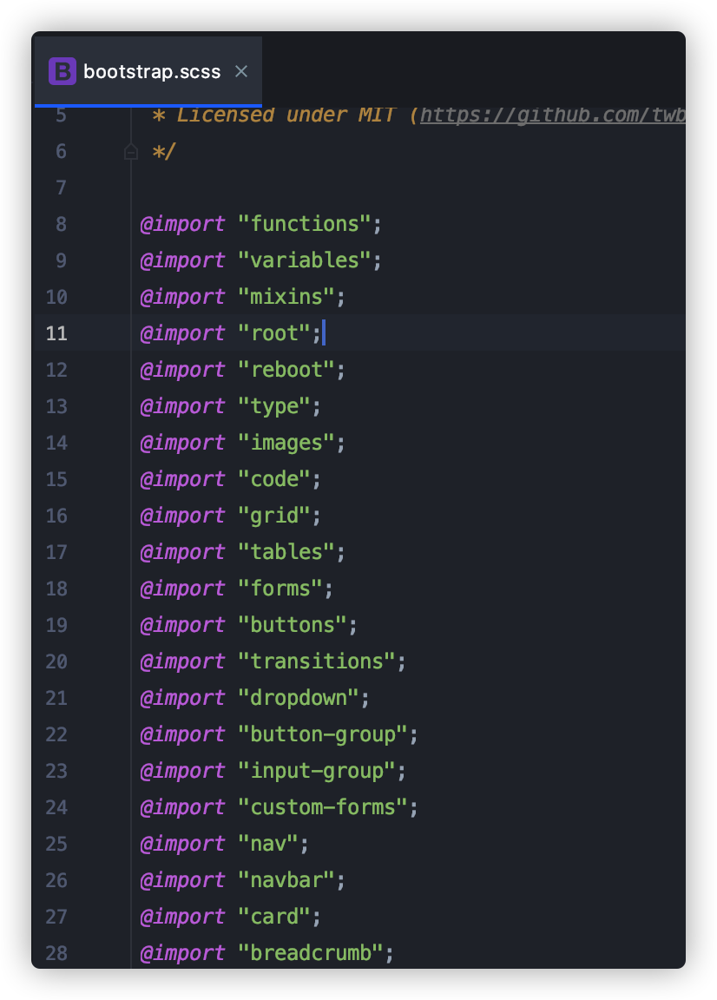

# sass在bootstrap中的使用
> 在学习完成了关于sass的相关知识点，回到最初的原点来提问：sass可以用来做什么？如何使用sass？
> 在学习了bootstrap的源码之后，借鉴于sass在它里面的一个使用，这边整理了以下几个要点，可供自己平时在日常项目coding
> 过程中，更好地来设计css，编写更加灵活简便的sass
> script来维护系统，以便于更加灵活的控制自己的系统/组件库！！！

### 一切以统一的入口开始
> 这有点类似于webpack中的entry入口，从入口开始，一个依赖一个，最终发散成为一棵
> :evergreen_tree:，这里借助于sass中的模块导入的方式，采用`@import
> _xxx`的方式，让每一个子模块仅作为其子模块参与编译即可！

### 应用实战
> 通过借鉴于sass在bootstrap中的一个使用情况，这边参考其设计原理，进行一个模仿设计，并从中得出以下几点，帮助自己在实际的
> 项目设计开始阶段进行一个全局的设计，为后续灵活扩展做好基础工作：

#### 1. 变量的统一管理(_variable.scss)
作为系统中全局变量，提供整个系统(或组件库)的统一配置化参数，对所有的参数统一采用`!default`标志代表所有的参数都是允许被配置的，
当在使用这些变量的时候，允许通过重载变量，来实现用户自定义配置的目的；

#### 2. 变量的分模块管理
可针对 :point_up_2:
中的`_variable.scss`中所出现的变量进行分模块管理，建议可采用不同的注释模块来进行维护管理；

#### 3. :stars: 变量配置基准数据源
作为其他各个模块待引用的基准数据源(可以是对象、数组)，然后其他的模块依赖此配置化参数，针对基准数据源做一个二次封装的机制，
生成对应场景下的样式组合

#### 4. _root的全局配置
配合css变量，将所有的css变量与`_variable.scss`中的变量配合，形成全局的css变量，可用整个系统去直接访问

#### 5. 衍生其他模块
将统一的变量作为基准配置，作为数据源，提供给`_function.scss`、`_mixin.scss`、`_reboot.scss`以及其他组件模块的被依赖对象，
根据实际应用场景，拆分为不同的功能板块
