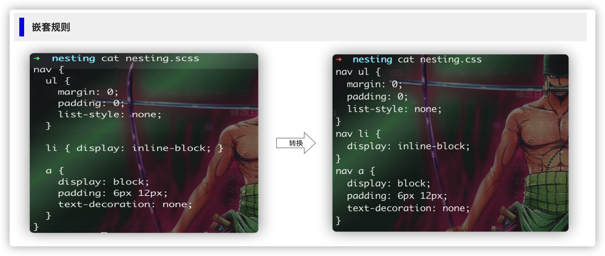
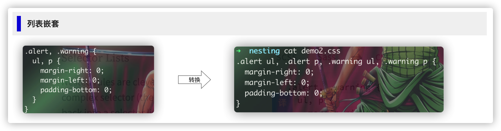
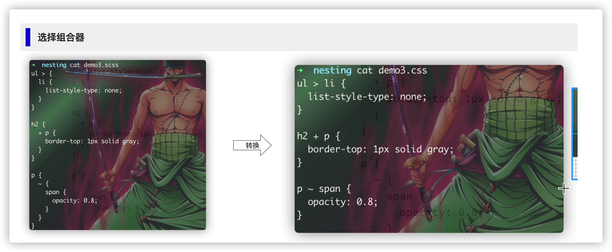
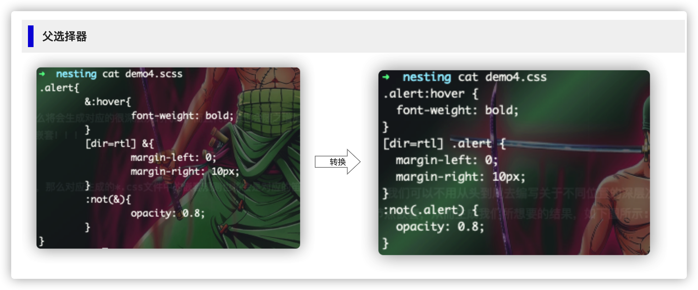
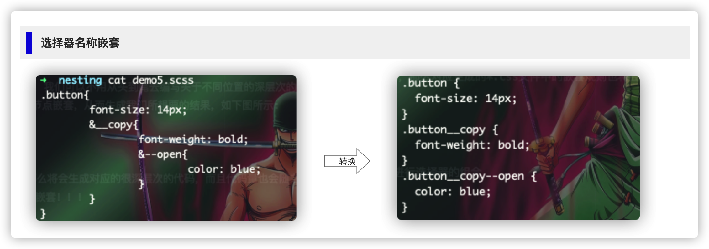
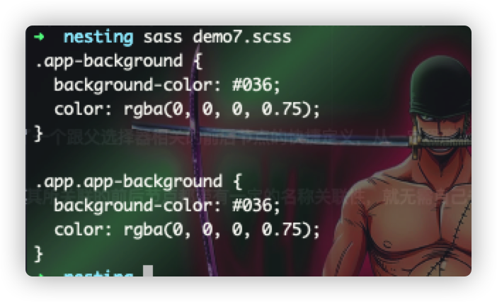
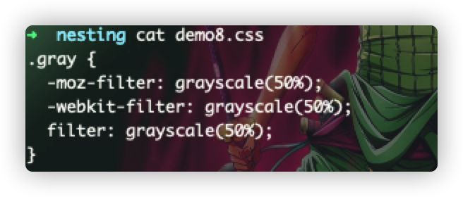
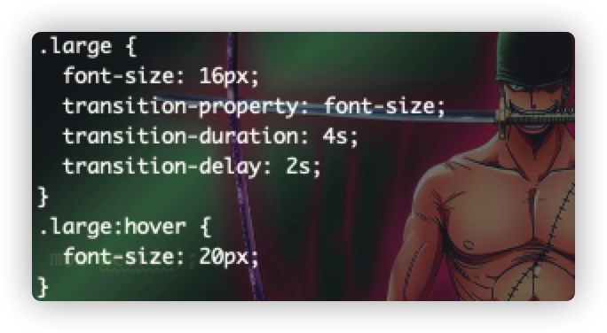
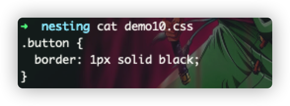

# 样式规则
> 样式规则就是sass的基础，就像它们也是css的基础一样，通过选择某个选择器，给其定义它的一个样式效果！！

```sass
.button {
  padding: 3px 10px;
  font-size: 12px;
  border-radius: 3px;
  border: 1px solid #e1e4e8;
}
```

### 嵌套
> 这也是使用sass经常用到的：**嵌套**，通过嵌套，我们可以不用从头到尾去编写关于不同位置的深层次的样式规则，而是简单的根据
> 目前html节点的嵌套规则，利用代码块符号()来将节点嵌套，从而生成我们所想要的结果，如下图所示:



:warning: 如果我们编写的sass嵌套得很深的话，那么将会生成对应的很深层次的代码，而且代码量也会随之增加，而导致请求的*.css需要
消耗的带宽更大，因此，尽量编写是层次不会那么深的嵌套！！！

#### 列表嵌套
> 如果在编写嵌套的时候，使用了关于列表嵌套的机制，那么对应生成的*.css文件中的嵌套规则也将会是对应的笛卡尔组合的效果，如下图所示：



#### 选择组合器
> sass/css提供了选择组合器(>、+、~)，可以快速进行选择器的组合



#### 父选择器
> sass提供了一种特殊的选择器(&)，用于在嵌套的时候，指向父选择，从而可以在被嵌套中指向父选择器，比如有以下的例子：



从上面:point_up: 例子我们可以看出父选择器提供了一个跟父选择器相关的前后节点的快捷定义，从一定程度上减少了编写的代码量，代码更加干练

:star2: 我们还可以在父选择器中给其🈯️定后缀，使其所关联的前后节点都带有一定的名称关联性，就无需自己去添加后缀来区分了，这尤其是在一些UI库框架中较为常见



:star2: 在sass的逻辑运算脚本中，比如在函数或者是混入中使用(&)，代表的是当前上下文所在的外部父选择器，如果它没有外部选择器的话，那么它就返回为null，否则就返回外部选择器，
这可以很方便地使用`if()`三目运算符来进行逻辑true/false判断，并执行对应的语句，比如赋值等操作，如下代码所示：

```scss
@mixin app-background($color){
  #{if(&, '&.app-background', '.app-background')}{
    background-color: $color;
    color: rgba(#000, 0.75);
  }
}

@include app-background(#036);

.app{
  @include app-background(#036);
}
```


👆这里如果`app-background`被包裹的话，则&返回true，否则就返回false，因此会有两种不同的输出结果！！！


### 插值
> 使用插值可以将变量和函数调用表达式中的值注入选择，在编写混入的时候特别游泳，因为通过这种方式，我们可以根据用户传入的参数来创建可根据参数进行变化的动态选择器

```scss
@mixin define-emoji($name, $glyph){
  span.emoji-#{$name} {
    font-family: "Helvetica Neue", Helvetica, Arial, sans-serif;
    font-variant: normal;
    font-weight: normal;
    content: $glyph;
  }
}

@include define-emoji("women-holding-hands", "two_women_holding_hands");

```


### 属性定义
> sass除了跟css一样的属性定义元素的样式之外，还增加了额外的功能，比如声明的值可以是任何sassscript表达式，将表达式的值进行自动计算并存储在其结果中！！！

```scss
.circle{
  $size: 100px;
  width: $size;
  height: $size;
  border-radius: $size * 0.5;
}
```

:star2: 在定义元素属性样式的时候，我们还可以使用*插值*来动态地生成我们所想要的属性的key，如下所示：

```scss
@mixin prefix($property, $value, $prefixes){
  @each $prefix in $prefixes{
    -#{$prefix}-#{$property}: $value;
  }
  #{$property}: $value;
}
.gray{
  @include prefix(filter, grayscale(50%), moz webkit);
}
```


:star2: 在平时编写css属性的时候，经常会 :u6709: 遇到同时属性前缀的情况，比如：background-color、background-image、background-size等等，而使用sass嵌套的时候，我们也可以利用这一个规则，
编写出简写的嵌套的sass样式表，需要做的仅仅是在外部添加一个可被css识别的前缀即可：

```scss
.large{
  font-size: 16px;
  transition: {
    property: font-size;
    duration: 4s;
    delay: 2s;
  }
  &:hover{
    font-size: 20px;
  }
}
```


:star2: 有时，我们想要编写可直接隐藏的属性，借助于`if()`三目运算符，通过判断传递变量/上下文，false则相当于隐藏该属性：

```scss
$radius: false;
.button{
  border: 1px solid black;
  border-radius: if($radius, 2px, null);
}
```



:star2: css中可以通过定义css变量，来作为公共的样式使用，而且可以在js中直接访问到这些值，而sass解析变量属性的时候，简单的直接原样地传递给css，唯一不同的就是可以通过插值来整！！！

```scss
$primary: #112233;
$accent: #456734;
$warn: #684050;

:root{
  --primary: #{$primary};
  --accent: #{$accent};
  --warn: #{$warn};
}
```


