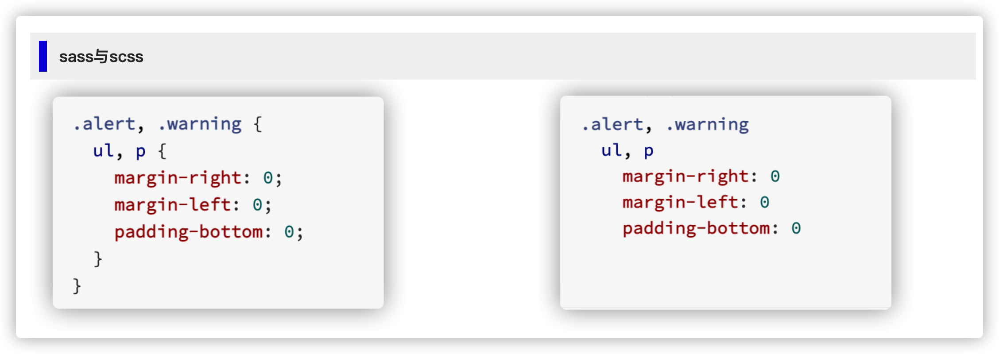

# 语法知识
> sass就是一个可以转换为普通css样式的样式语言，它允许我们使用**变量、嵌套、混入、函数、模块化、数学运算、逻辑运算**等等，且能够完全适配到css的语法。
> sass有助于保持大型样式表的良好组织结构，使其更加易于在项目内部以及项目之间共享公共模块设计！！！
>
> :warning: 这里:u6709:一个关键点需要记住是：**sass是一个预处理语言，它将编写的样式+代码进行一个组合，然后编译生成目标css样式，这也就说明了样式与代码之间:u6709:一定的鸿沟，或者说是壁垒！！**

### sass与scss傻傻分不清
> 首先两者文件后缀名的不同，一个是*.sass，一个是*.scss，两者可以互相转换，但一般在正常项目迭代开发过程中，建议必须选择其中一种，来保持项目团队的整体统一性。

:star2:
从这里我们可以看出关于sass与scss两者的一个简单区别，无非就是有无花括号的而已，而sass在编写上更加接近于css，且代码的阅读可读性较高，因此，后续将统一采用sass来编写我们的样式！！

### sass的结构
> 与普通的css一样，大部分sass由正规的css样式键值对来组成，但是sass也包含了css所没有的的一些特殊属性在其中。
> 一般的，组成代码的基础元素是**语句 + 表达式**，sass也不例外！

#### 语句
> sass样式表由一系列语句组成，语句按照一定的规则来组合称语句块，语句块由"{}"来包裹组成

| 语句类型 | 描述 |
|---|---|
| 通用语句 | 普通的sass语句，可以在任何地方被使用，像变量的定义、流程控制、调试语句 |
| css语句 | 用于生产css样式，除了在`@function`中不能使用之外，其他地方都可使用 |
| 顶层语句 | 一般在其他样式文件定义的最上层位置定义，或者在嵌套的代码块顶部定义，可以是模块的加载、导入、混入的定义或者是函数的定义 |

#### 表达式
> 表达式位于属性或者变量声明右侧的任何内容，每个表达式都会生成一个值，任何有效的css属性值也是一个sass表达式

|表达式类型|描述|
|---|---|
| 常量表达式 | 像编写代码时的常量定义，比如有Numbers、String、Colors、Boolean、null、List、Maps |
| 操作表达式 | `==、!=、+-*/、<、<=、>、>=、and、or、not、()` |
| 其他表达式 | 变量引用，函数调用，父类选择器，!important |

### 注释
> sass中的注释与js中的注释类似，包括单行注释(//)以及多行注释(/**/)，一般地，如果我们想要将注释也对应输出到css文件中的话，
> 则采用多行注释的方式。
> :warning: 在使用注释的时候，需要注意的一个地方，就是如果没有修改到sass代码，而只是修改了注释的话，要重新看对应的注释效果
> 的话，需要将结果文件删掉，或者是强制重新生成*.css文件

:star2: 在使用sass来编写样式库的时候，特别是作为公共的函数、混入、变量等方式提供给其他同事使用的时候，一定要编写对应的注释
文档，提升代码可读性，方便其他同事后续扩展，避免重复发明轮子。

:link: 开源的关于sassdoc帮助我们提供了关于如何生成精美的sass注释，详情可以参考链接[SassDoc](http://sassdoc.com/)
