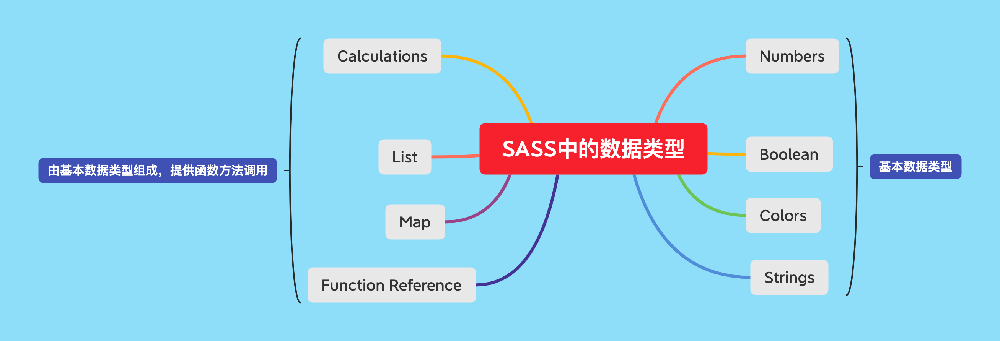
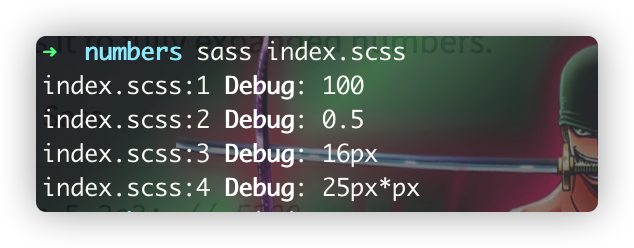
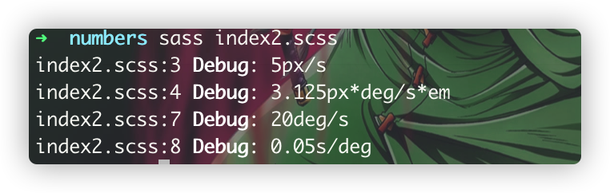
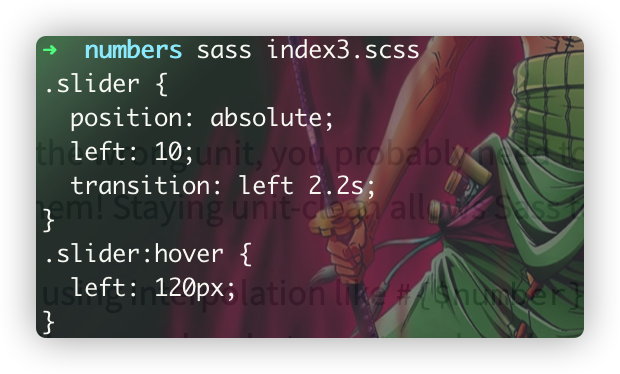
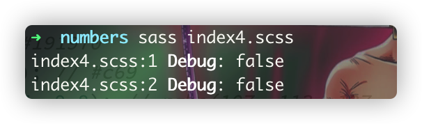
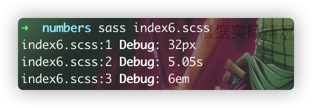
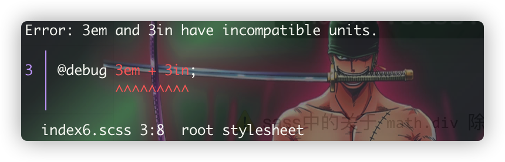
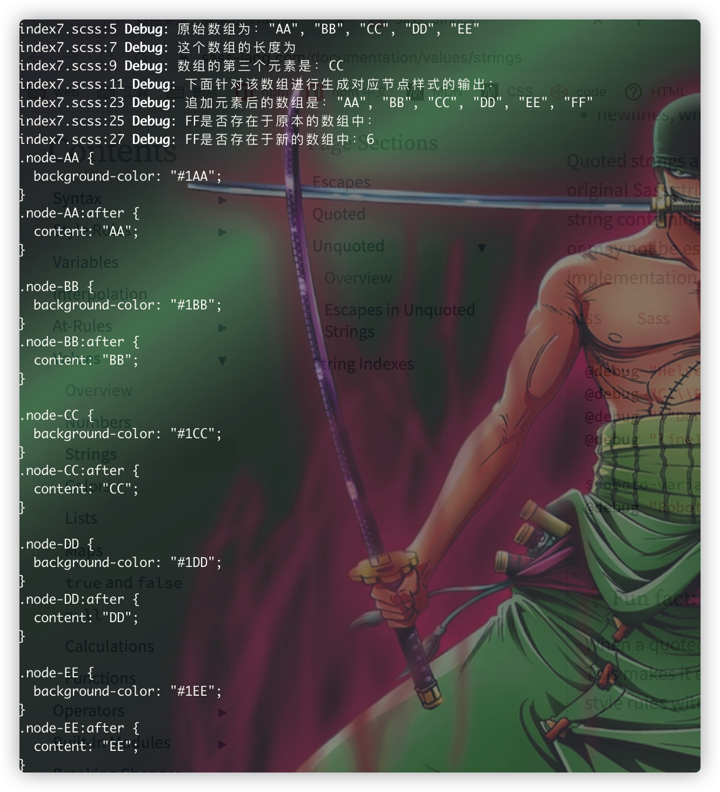
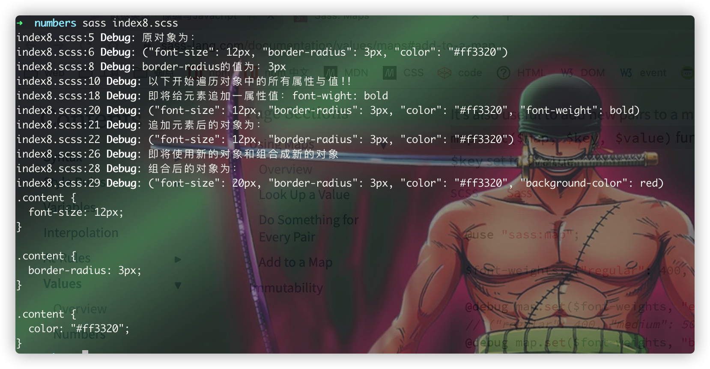

# 数据类型
> sass结合了css以及js的数据类型，因为它既 :u6709: css的表现方式，也 :u6709:
> js中的数据类型的展现形式，在sass中一般是用 :one:
> 变量来存储对应的数据，一般在sass中有以下图的数据类型：



### Numbers
> sass中的`Numbers`可以由两部分组成：数字 + 单位，`Numbers`类型的变量，它可以
> :u6709: 单位，也可以没有单位，具体按照实际情况进行处理，比如 :u6709:
> 以下场景：

```scss
// index.scss
@debug 100;
@debug 0.5;
@debug 16px;
@debug 5px * 5px;
```


#### Numbers更贴近生活
> 可以从 :point_up:
> 例子的最后一个输出`25px*px`，这有点类似于数学应用中的`平方px`，也就是说sass中的单位更具有实际的意义，它能够模拟到真实世界中的
> 关于单位的实际应用场景，比如平方、立方、千米每小时等等，如下所示：

```scss
// index2.scss
@use 'sass:math';

@debug math.div(10px, 2s);
@debug 5px * math.div(math.div(30deg, 2s), 24em);

$degrees-per-second: math.div(20deg, 1s);
@debug $degrees-per-second;
@debug math.div(1, $degrees-per-second);
```
  
从 :point_up_2:
我们可以看出sass中的单位与真实世界中的数学应用是能够完全对应上的，这里有一个点需要
:warning: 的是：既然sass中的单位在真实世界中是 :u6709:
关联的，那么是否可以直接将它给输出到css呢？答案是不可以的，如果直接输出到css中的话，将会导致程序的报错了，那么这个功能是不是很鸡肋呢？
提供了一个复杂单位的数学运算，然后其结果不能用来用到实际的场景？答案肯定不是的，:stars:
我们可以用它来做与数学应用实际相关联的逻辑运算，并在最后输出css能够识别到的样式代码。

```scss
// index3.scss
@use 'sass:math';

$transition-speed: math.div(1s, 50px);	//1/50s每px

@mixin move($left-start, $left-stop){
	position: absolute;
	left: $left-start;
	transition: left ($left-stop - $left-start) * $transition-speed;
	&:hover{
		left: $left-stop;
	}
}
.slider{
	@include move(10, 120px);
}
```


一般很难精准计算出目标结果，可以结合复杂单位运用到实际场景中，从侧面来计算出对应的目标结果值！！！

:star: 如果一个变量有单位，另外一个变量没有单位，那么两者是否一致呢？
答案是否定的，虽然sass中的数值中的单位是可选的，但是它两者代表的是不同的

```scss
// index4.scss
@debug 10 == 10px;
@debug 10px == 10;
```


:warning:
sass中的关于`math.div`除法运算，它不想其他的编程语言(比如java)，它在执行的过程中，不会因为除数与被除数的关系，而使结果仅保留整数部分，
它会按照实际场景保留对应的小数部分！！！

:stars: 在sass中 :u6709:
一种比较特殊的场景，就是同个`"领域"`下的数据类型，将会发生自动转换，转换的过程，根据实际情况而定，如下所示：

```scss
@debug 30px + 2;
@debug 5s + 50ms;
@debug 3em + 3;
```


:warning: 从 :point_up: 可以看出: 不带单位的数据，将会被自动转换为 :u6709:
对应单位的一个数学运算结果，那么假如两个都是长度尺寸单位下的运算的话，又会发生怎样的一个情况呢
:point_right: 将会直接报错，停止运行了，如下图所示：



### Colors
> sass中的关于颜色数据类型，完全来自于css中的css颜色数据类型：
> 1. 具有特定意义的颜色值：blue、red、green；
> 2. 十六进制颜色值：#112233；
> 3. 颜色函数：rgb()或者rgba()或者hsl()或者hsla();

### Strings
> sass中的字符串，🉑️由引号包裹起来，也可以不由引号包裹，两者之间可以进行一个互相转换(借助于`sass:string`所提供的一公共api)。
> :stars:
> 一般来说，带引号与不带引号的字符串两者没有什么区别，一般sass在执行的过程中将会自动进行转换，但是假如
> :u6709: :point_down: 的一些情况下，sass将不会自动进行转换：

1. css颜色名称(比如blue、green、red等)，它只会转换为对应的Color数据类型；
2. null数据类型，只会转换为对应的null数据类型；
3. true/false，只会转换为对应的真值/假值；
4. and、or、not，只会转换为对应的与或非；

:stars: 从 :point_up:
我们可以得出在日常coding过程中，是字符串类型的数据统一采用引号来包裹起来，而不是直接交给sass去做自动转换，这样子可以避免一些不必要的
未知异常的发生，给自己写bug！！！

### Booleans
> sass中的`Booleans`数据与js中的Boolean基本数据类型一致，通过提供的真/假来与其他的判断、循环语句进行结合，实现代码块的按需(真/假)来执行。
> 主要由 :point_down: 几种结合方式：

1.  与`@if`条件判断的结合；
2.  与逻辑与或非(and、or、not)的结合；
3.  与三目运算符`if`的结合；
4.  与`@while`循环的结合；

### List
> 与其他的编程语言所不同的是，sass中的数组类型的数据，由**空格**、**逗号**分割而形成一数组，无需额外使用其他标志符，
> 一个List数组可以包含有0个或者以上任意数量的孩子元素，一个数组的常规表达式语法如下所示：
> `<expression>, <expression>`或者`[<expression>]`  
> 而空数组，则可以由`()`或者`[]`来表示
>
> :warning:
> 建议在日常的coding过程中，采用`[]`来表示一个空数组，这里采用这种方式，主要是为了与
> :point_down: 的Map混淆了！！！

#### 像js中的数组一样来使用sass中的List
> 一个数组List，必然 :u6709:
> 对应的一系列操作，不然就只是单纯的进行数据的存储而已，而对于List， :u6709:
> :point_down: 几种方式来使用List来服务于自己的程序：

1. 下标的访问：`indexes`，与其他任何一门编程语言所不同的是，sass中List的下标是从1开始算起的，而且如果负数的话，则代表从尾部算起；
2. 数组元素的访问：`list.nth($list, $index)`，通过给定的下标来访问数组的元素；
3. 数组元素的遍历：`@each $item in
   $list`，与`@each`艾特规则结合，来遍历数组中的每一个元素；
4. 数组元素的追加：`list.append($list,
   $item)`，通过在数组尾部追加一个新的孩子元素，返回出一个**新**的数组；
5. 数组元素的查找：`list.index($list, $item)`，返回出查找到的元素的下标

针对上述几种情况，这边统一以一个例子来阐述对应的使用：

```scss
// index7.scss
@use "sass:list";

$list: 'AA', 'BB', 'CC', 'DD', 'EE';

@debug "原始数组为："+$list;

@debug "这个数组的长度为";

@debug "数组的第三个元素是：" + list.nth($list, 3);

@debug "下面针对该数组进行生成对应节点样式的输出：";

@each $item in $list {
	.node-#{$item} {
		background-color: "#1"+#{$item};
		&:after{
			content: $item;
		}
	}
}

$newList: list.append($list, 'FF');
@debug "追加元素后的数组是：" + $newList;

@debug "FF是否存在于原本的数组中：" + list.index($list, 'FF');

@debug "FF是否存在于新的数组中：" + list.index($newList, 'FF');
```


:stars: 从 :point_up_2:
我们可以看出原数组在被`append`后，是返回了一个新的操作后的数组，而原来的数组则保持不变！！！

### Map
> sass中的`Map`与js中的对象字面量相类似，只不过sass中的`Map`所不一样的是它是由`()`来包裹起来的，都是由不同的
> `key+value`，都逗号分割来组成的，每一个key都可以由不同类型的数据来组成，但是在实际的coding过程中，应当尽量采用
> 具有对应意义的字符串来作为key，这个是为了编写他人能够看得懂的、可维护的代码。  
> :warning: 在表示一个 :u7a7a: 对象的时候，虽然可以采用
> `[]或者()`来表示，但是尽量是采用`()`来表示，为了与 :point_up_2: 的 :u7a7a:
> 数组给区分开来，目的也都是为了更加方便的进行代码阅读与维护！！！

#### 像Java中的Map对象一样来使用Map
> 与List类似，sass中的sass它也提供了一系列的API操作，来方便我们进行逻辑的编写

1. 值的获取: map.get($map, $key)，获取一个对象中key所对应的值；
2. 内容遍历: @each $key, $value in
   $map，通过`@each`加上传递的$key与$value代表，来遍历一个对象；
3. 追加元素：map.set($map, $key,
   $value)，给对象加上一对属性值，如果$key原本存在，则覆盖掉原来的属性所对应的值；
4. 对象的合并：map.merge($map1,
   $map2)，合并两个对象，并返回一个新的对象，在合并过程中若$map2中由key存在于$map1中，则使用后者的值来覆盖前者的值

:stars: 针对上述的情况，这边统一整理以下的一个例子来阐述如何使用sass中的Map

```scss
// index8.scss
@use "sass:map";

$map: ('font-size': 12px, 'border-radius': 3px, 'color': '#ff3320');

@debug "原对象为：";
@debug $map;

@debug "border-radius的值为：" + map.get($map, 'border-radius');

@debug "以下开始遍历对象中的所有属性与值!!";

@each $key, $value in $map {
	.content{
		#{$key}: $value;
	}
}

@debug "即将给元素追加一属性值：font-wight: bold";

@debug map.set($map, 'font-weight', bold);
@debug "追加元素后的对象为：";
@debug $map;

$map2: ('background-color': red, 'font-size': 20px);

@debug "即将使用新的对象和组合成新的对象";
$map3: map.merge($map, $map2);
@debug "组合后的对象为：" ;
@debug $map3;
```


### Calculations
>

### Functions

### Null
