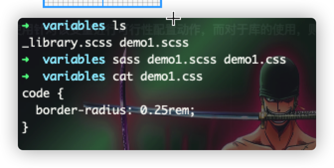
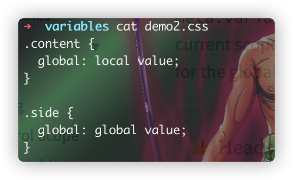
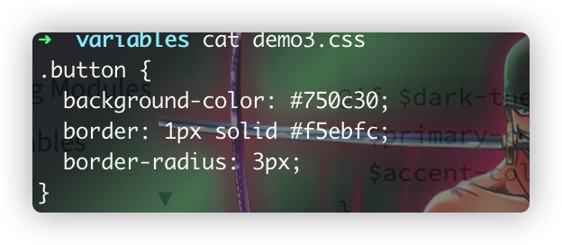

# 变量
> sass中的变量以$开头，然后是字母+数字+符号来命名的，这里又一个特殊的需要mark一下的就是：中横线的变量与下横线的变量在sass范围内，属于是同一个变量！！
> sass变量，作为sass领域内的重要价值的工具之一，解决了关于样式属性具有上下文关联动作的统一口径，比如可以定义全局主题色，通过修改变量的方式，可以编译出全局统一一个资源属性值的结果！

### 定义与使用
```scss
  $x: #123456;
```
:star2: 变量的定义，只能是**在样式代码块中定义，或者是在逻辑运算**中定义，而且这里不同位置的定义，将会有不同的一个效果(**值的覆盖使用**)

:frowning: 与css变量的区别：
1. sass变量是被与处理器编译输出最终目标样式的，而css变量则是原样输出;
2. css变量在不同的节点中可以有不同的值，而sass变量则是每一次瞬间只能有唯一的一个值；
3. css变量是全局共享的，一旦改变它的值，则会影响到全局所有的样式，而sass变量则是编译时生效，一旦改变它的值，则距离该变量最近以及后续的将会受到影响

### 可配置的默认值
> 这有点类似于ES6.0中的函数默认值，或者是对象结构的默认值一般，sass变量在声明时，可定义一默认值(通过使用`!default`)标识来配置，代表的是若无定义该变量的值，或者是null的时候，就使用当前变量的默认值，
> 同时当将其作为库共给其他sass文件使用时，可以使用针对该变量进行可行性配置动作，而对于库的使用，则一般是使用`@rule library_name with (<key>: <value>)`，传递进来的变量值，则将会替代原来的库中
> 的默认值

```scss
// _library.scss
$black: #000 !default;
$border-radius: 0.5rem !default;

code{
	border-radius: $border-radius;
}
// demo1.scss
@use 'library' with (
  $black: #222,
  $border-radius: 0.1rem
);
```


### 库中的常量
> 与可配置的默认值相对应的，如果没有设置了`!default`标识的话，那么该变量不允许被外部所改变，而是只能简单的直接访问而已，这有点类似于js中的const变量，一旦定义，就不能修改

```scss
@use "sass:math" as math;
@debug math.$pi;
// 以下将直接报错
math.$pi: 0;
```

### 作用域
> 与js中的变量作用域类似，sass变量也拥有同样类似的变量作用域效果，在某个模块中顶部位置所定义的变量，将会被模块应用者以及当前模块上下文可访问到(但这仅限于样式定义的变量)

```scss
$global-variable: global value;
.content{
  $local-variable: local value;
  global: $global-variable;
  local: $local-variable;
}
.side{
  global: $global-variable;
}
```
:warning:
这里使用的是不同名变量的在普通的样式属性代码中使用的变量，也是较常用的一种方式

#### 全局作用域与局部作用域
> 🤔
> 这里如果我们使用的是局部样式中的变量与全局或者外部变量中的sass变量同名的话，这里又会发生怎样的一个情况呢？
> 如下代码所示：

```scss
$global-variable: global value;
.content{
  $global-variable: local value;
  global: $global-variable;
}
.side{
  global: $global-variable;
}
```


:star2:
从上述编译结果我们可以看出，当**样式属性**中内部作用域下的变量与外部作用域下的变量同名时，**样式属性中重新声明的变量**将会当作是创建
当前样式属性作用域下的**新变量**并来使用该值！！！
这里必须要强调的是样式属性代码下所形成的作用域，因为在下面:point_down:的由流程关键词所形成的流程作用域，将会使用的同一个sass变量，
具体看下面的介绍。

:stars:
🤔假如我们一定要在样式属性代码中使用外层sass变量的话，是否可以做到呢？当然是可以的，我们可以通过标识符`!global`来对外层sass变量
进行一个引用，但这里 :u6709:
一个前提条件：**样式代码中所重新定义的变量，必须在外层作用域范围内有效**

#### 流程作用域
> 通过使用`@rule`流程标识符所形成的基于逻辑代码层面所形成的代码流程作用域，比如通过使用`@if、@while、@each`等所形成的局部作用域，
> 这里与上面 :point_up: 的样式作用域下的变量 :u6709:
> 一个明显的区别，就是流程作用域下的sass变量与外层作用域的变量**共享**同一个变量，他们拥有公共的值，无需通过使用`!global`标识符
> 来设置访问同一个变量

```scss
$dark-theme: true !default;
$primary-color: #f8bbd0 !default;
$accent-color: #6a1b9a !default;

@if $dark-theme {
  $primary-color: darken($primary-color, 60%);
  $accent-color: lighten($accent-color, 60%);
}

.button {
  background-color: $primary-color;
  border: 1px solid $accent-color;
  border-radius: 3px;
}
```


:stars: 那么这里为什么会 :u6709: 这样子的区别呢？-->样式作用域的 :new:
变量与流程作用域下的同一个变量！！ 因为这个 :u6709:
一个大前提条件：**sass是一个预编译的语言**，简单地理解，就是类似于js与css代码之间的一个边界，js代码肯定能够访问到作用域范围下的
同一个变量，这个是作用域变量的基本规则，而css则是在编译时，通过就近原则，访问到的变量来作为当前样式作用域下的
:new: 变量而已。

### 高级变量函数
> sass提供了一对针对变量的函数
> 1. meta.variable-exists()：判断当前作用域下或者对象中是否存在这个某个变量的定义，若
>    :u6709: 定义则返回true，否则放回false
> 2.  meta.global-variable-exists()：与上述类似，只不过这里判断的是全局作用域下的
